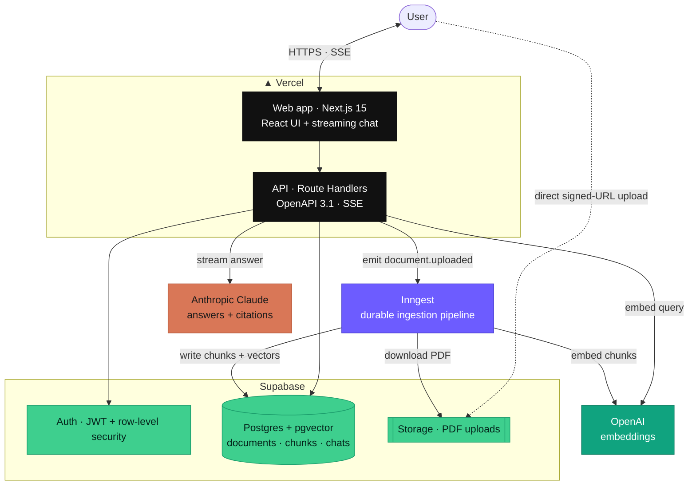
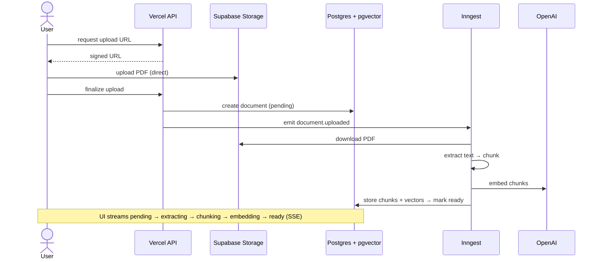
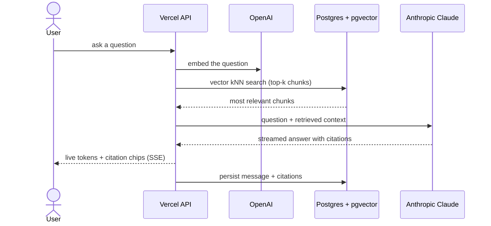

# Knowledge Graph Document Chat — starter

A production-grade document Q&A system with traceable citations,
document-lifecycle awareness, and a knowledge-graph layer. This repository is
the **open-source Apache 2.0 starter** (Tiers 0–1): a credible, deployable,
forkable foundation. The commercial product (Tiers 2–4) is built privately on
top of it.

> **Status:** Tier 1 — the working starter. Upload a PDF, watch ingestion
> stream from `pending → extracting → chunking → embedding → ready`, then
> open a chat and ask a question. Tokens stream in via SSE; citation chips
> link each claim to the chunk it came from. Every PR is scored against a
> golden Q&A set and gated on REQ-1.5.3's citation-precision threshold.

## Quick start

Prerequisites: **Node 20** (`.nvmrc`), **pnpm 9** (`corepack enable pnpm`),
**Docker** (for Supabase), and the **Supabase CLI**. See
[docs/deploy.md](./docs/deploy.md#prerequisites) for OS-specific install
instructions.

```bash
pnpm install
cp .env.example .env.local      # fill in OpenAI + Anthropic keys (see below)
pnpm dev:all                    # supabase start + next dev
pnpm dev:inngest                # in a second terminal — discovers /api/inngest
```

Open <http://localhost:3000>, sign up, upload a PDF, wait for `ready`, and
start a chat. Full demo walkthrough:
[docs/deploy.md](./docs/deploy.md#try-the-tier-1-demo-end-to-end).

### Minimum environment

You need API keys for both providers (small monthly caps recommended):

- `OPENAI_API_KEY` — embeddings (text-embedding-3-small). Used at ingestion
  and at retrieval time. Without it, uploads stay in `failed`.
- `ANTHROPIC_API_KEY` — chat completion (Claude). Without it, the streaming
  chat endpoint returns 503.

Supabase values come from `pnpm db:start` output. See
[`.env.example`](./.env.example) for the full matrix.

## Architecture

A retrieval-augmented Q&A service over your own PDFs: every answer streams in
with inline citations that link back to the exact source passage. It's
**API-first** — an OpenAPI 3.1 contract drives both the backend and a generated,
type-safe frontend client — and runs entirely on managed cloud services.

### Deployed system



### How ingestion works — upload → searchable

The browser uploads straight to storage via a signed URL (bypassing serverless
body limits); a durable Inngest pipeline then extracts, chunks, and embeds the
document, streaming live status to the UI.



### How a question is answered — RAG + citations

The query is embedded and matched against the document vectors; the most
relevant chunks are handed to Claude, which streams an answer whose citations
point back to specific source chunks.



Repository layout and the contract-first workflow are covered in
[Project structure](#project-structure) below; full detail in
[architecture.md](./architecture.md).

## Project structure

```
apps/web/                 Next.js 15 app — Route Handlers (/api/*) + UI
apps/eval-cli/            Thin CLI around @document-chat/eval (mock + live)
packages/contracts/       OpenAPI 3.1 spec, SSE event schema, generated types
packages/retrieval/       Chunking + embeddings + kNN search (pure)
packages/eval/            Golden Q&A loader, metrics, runner, fixtures
supabase/                 Local dev config + SQL migrations
docs/                     deploy.md + Architecture Decision Records (adr/)
scripts/                  Repo tooling (license-header check, smoke probe)
.github/workflows/        CI, gitleaks, eval, smoke, auto-merge
```

## Common commands

| Command | What it does |
|---|---|
| `pnpm dev` | Run the web app (no database needed for Tier 0) |
| `pnpm dev:all` | Start Supabase, then the web app |
| `pnpm dev:inngest` | Start the Inngest dev server (discovers `/api/inngest`) |
| `pnpm build` | Build all packages via Turborepo |
| `pnpm test` | Run unit + contract tests (Vitest) |
| `pnpm lint` / `pnpm typecheck` | ESLint / TypeScript checks |
| `pnpm license:check` | Verify SPDX headers on source files |
| `pnpm smoke -- --base-url <url>` | Post-deploy smoke probe against `/api/health` + `/api/version` |
| `pnpm --filter @document-chat/contracts run generate` | Regenerate the TS client from the spec |
| `pnpm --filter eval-cli run start -- --mock` | Run the golden eval against canned transcripts |
| `pnpm db:start` / `pnpm db:reset` / `pnpm db:stop` | Local Supabase lifecycle |

## Running tests

All test commands run from the repo root. Integration and e2e start Supabase automatically (`supabase start` is idempotent).

| Command | What it runs | Prerequisites |
|---|---|---|
| `pnpm test` (alias `pnpm test:unit`) | Unit + contract tests (Vitest), all packages | none |
| `pnpm test:integration` | Supabase-backed integration tests | Docker (auto-starts Supabase) |
| `pnpm test:e2e` | Playwright end-to-end tests (auto-builds the web app first) | Docker + browser (see setup) |
| `pnpm test:e2e:ui` | Playwright UI mode — visual runner / debugger | same as `test:e2e` |
| `pnpm test:all` | unit → integration → e2e, in sequence | Docker + browser |
| `pnpm test:e2e:setup` | One-time: install the Playwright chromium browser + OS deps | sudo (Linux) |

E2E notes:
- Run `pnpm test:e2e:setup` once per machine before the first `pnpm test:e2e`.
- The VS Code Playwright Test Explorer is currently incompatible with the pinned Playwright on Ubuntu 26.04 — run e2e from the terminal (or `pnpm test:e2e:ui` for a visual runner).

## Planning docs

- **[goals.md](./goals.md)** — business goals, public/private structure, licensing.
- **[requirements.md](./requirements.md)** — behavioral requirements by phase.
- **[architecture.md](./architecture.md)** — technology choices and system shape.
- **[implementation.md](./implementation.md)** — tiers, working agreements, plan.
- **[docs/adr/](./docs/adr/)** — Architecture Decision Records (one per material choice).

## Contributing

Open a PR — contributions are accepted under [Apache 2.0](./LICENSE) (inbound =
outbound). CI runs lint, type-check, tests, and the eval gate; green PRs merge
automatically. See [CONTRIBUTING.md](./CONTRIBUTING.md).

## License

[Apache 2.0](./LICENSE). See [NOTICE](./NOTICE) for attribution.
